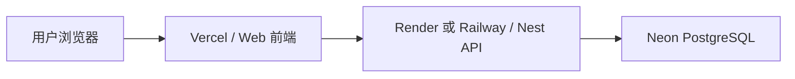

# Airbhb 部署方案（演示环境）

## 文档目的

本方案用于 Airbhb 项目的演示环境、答辩环境和作品集环境部署，不以正式商业生产环境为目标，而是优先保证：

1. 成本尽量低
2. 上线链路尽量清晰
3. 前后端职责分离
4. 后续可迁移到更正式的平台

## 当前部署决策

截至 2026-04-24，项目部署计划暂时后置，不立即单独上线。

原因：

1. 当前项目已具备可部署能力，但仍以业务完善和求职材料补充为优先
2. 若单独上线，后端和数据库的长期稳定托管通常仍会带来一定成本或额度限制
3. 后续计划与其他项目统一评估部署方案，再决定是否集中上线

因此，本方案属于“准备好的部署文档”，在需要上线时可以直接执行。

## 推荐部署目标

### 目标定位

- 可演示
- 可答辩
- 可供老师、同学、面试官试用

### 不作为当前目标的能力

- 长期高可用生产运营
- 高并发
- 完整监控告警
- 对象存储级别的图片体系

## 推荐部署架构

推荐采用前后端分离部署：

- 前端：Vercel
- 后端：Render 或 Railway
- 数据库：Neon PostgreSQL



## 为什么这样分

### 前端放 Vercel

原因：

1. 当前前端是 Vite 静态产物，部署非常自然
2. 项目使用 `HashRouter`，不依赖服务端路由回退规则
3. 静态站点免费部署最省心

对应代码：

- [apps/web/src/main.jsx](/Users/canlanshaw/bishe/project/airbhb/apps/web/src/main.jsx)

### 后端不优先放 Vercel

原因：

1. 当前后端是 NestJS 常规服务，不是为 Serverless 优化的结构
2. Prisma + PostgreSQL 在 Serverless 环境下连接管理更复杂
3. Render / Railway 更适合常驻 Node 服务部署

### 数据库放 Neon

原因：

1. 当前项目使用 Prisma + PostgreSQL
2. Neon 更贴近现有技术栈
3. 演示环境下成本和使用门槛都更友好

## 当前项目的部署前提

### 前端

前端构建命令：

```bash
pnpm build:web
```

环境变量：

- `VITE_API_BASE_URL`

示例文件：

- [apps/web/.env.example](/Users/canlanshaw/bishe/project/airbhb/apps/web/.env.example)

### 后端

后端构建命令：

```bash
pnpm build:api
```

环境变量：

- `DATABASE_URL`
- `JWT_SECRET`
- `PORT`

示例文件：

- [apps/api/.env.example](/Users/canlanshaw/bishe/project/airbhb/apps/api/.env.example)

后端入口：

- [apps/api/src/main.ts](/Users/canlanshaw/bishe/project/airbhb/apps/api/src/main.ts)

### 数据库

本地开发当前通过 Docker Compose 启动 PostgreSQL：

- [docker-compose.yml](/Users/canlanshaw/bishe/project/airbhb/docker-compose.yml)

线上环境则建议直接使用托管 PostgreSQL，而不是继续依赖 Docker 本地配置。

## 建议的实际部署步骤

### 第一步：准备数据库

建议选择 Neon，并创建一个新的 PostgreSQL 实例。

拿到连接串后，写入：

```env
DATABASE_URL=postgresql://...
```

### 第二步：部署后端

建议选择 Render Web Service 或 Railway Node Service。

后端部署核心配置：

- Root/Working Directory：`apps/api`
- Build Command：`pnpm build`
- Start Command：`pnpm start:prod`

需要配置的环境变量：

- `DATABASE_URL`
- `JWT_SECRET`
- `PORT`

首次上线后，执行数据库迁移与 seed。

建议执行顺序：

```bash
pnpm prisma:migrate
pnpm prisma:seed
```

如果平台不方便直接执行 workspace 根脚本，也可在 `apps/api` 目录下按 Prisma 原生命令执行。

### 第三步：部署前端

建议选择 Vercel。

前端部署核心配置：

- Root Directory：`apps/web`
- Build Command：`pnpm build`
- Output：Vite 默认 `dist`

前端环境变量：

```env
VITE_API_BASE_URL=https://你的后端域名/api
```

## 上线前检查清单

### 必须检查

1. `JWT_SECRET` 不得继续使用默认示例值
2. `VITE_API_BASE_URL` 指向线上 API
3. 数据库迁移已执行
4. seed 已执行或已准备好初始数据
5. 后端健康检查可访问：

```text
/api/health
```

### 建议检查

1. 登录、注册是否可用
2. 房源发布是否可用
3. 管理后台审核是否可用
4. 收藏、浏览历史、订单流程是否可用
5. 详情页直接刷新是否正常

## 当前暂不处理的问题

### 图片存储

当前项目尚未引入对象存储，图片存储升级暂不在本阶段推进。

这意味着：

1. 演示环境可以继续使用当前方案
2. 不建议把它视为长期生产级图片方案
3. 后续如果进入正式上线阶段，再升级为 OSS / S3 / R2 一类对象存储

## 风险与限制

### 免费部署常见限制

如果使用免费套餐，通常会遇到：

1. 后端休眠冷启动
2. 数据库额度限制
3. 较少的监控能力
4. 不适合长时间稳定运营

### 当前项目的现实定位

基于现阶段目标，这些限制是可以接受的，因为项目当前主要服务于：

- 毕设答辩
- 项目展示
- 求职作品集

## 后续升级路线

如果后续需要正式对外长期运行，建议按这个顺序升级：

1. 固定部署平台与域名
2. 收紧 CORS 配置
3. 替换默认密钥
4. 增加对象存储
5. 增加日志与监控
6. 补充测试与部署文档

## 当前结论

当前项目已经具备演示环境部署条件，但部署工作暂时后置。

建议策略是：

1. 继续完成业务与文档完善
2. 等其他项目完成后统一评估部署方案
3. 届时优先采用“前端 Vercel + 后端 Render/Railway + 数据库 Neon”的低成本组合
