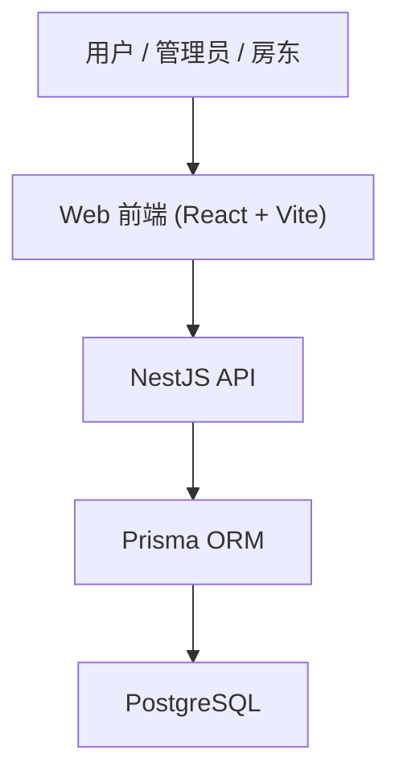
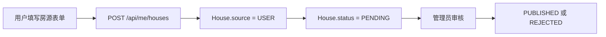
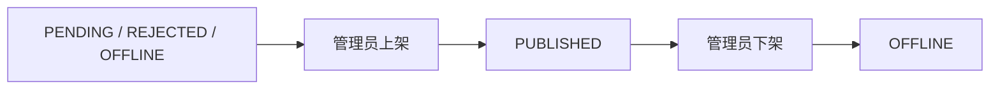
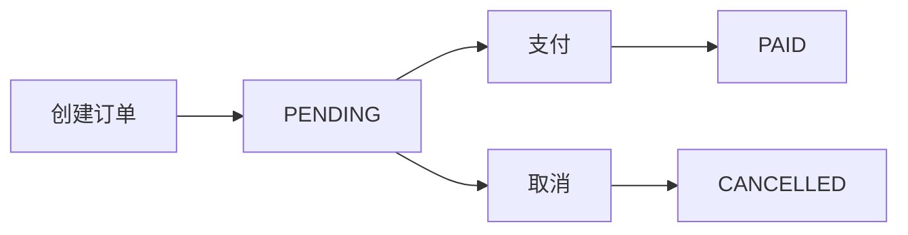

# Airbhb API 与架构文档

## 文档目标

本文件用于说明 Airbhb 项目的：

1. 系统架构
2. 前后端职责分层
3. 数据模型设计
4. API 模块划分
5. 关键业务流转

它既可以作为项目内部说明，也可以作为答辩、求职、作品集讲解材料。

## 一、整体架构

项目采用前后端分离架构：

- 前端：React + Vite
- 后端：NestJS + Prisma
- 数据库：PostgreSQL



## 二、前后端职责

### 前端职责

前端负责：

- 页面渲染
- 表单交互
- 登录态保存
- 列表、详情、后台界面展示
- 调用 API 并呈现结果

核心页面包括：

- `/home`
- `/entire`
- `/detail/:id`
- `/profile`
- `/publish-house`
- `/admin`

### 后端职责

后端负责：

- 注册登录与 JWT 鉴权
- 房源创建、修改、审核、上下架
- 收藏和浏览历史
- 订单创建、支付、取消
- 后台管理接口
- 数据权限与角色校验

## 三、代码结构

### 前端结构

```text
apps/web/src
├── components
├── views
├── services
├── store
├── router
└── assets
```

### 后端结构

```text
apps/api/src
├── modules
│   ├── auth
│   ├── houses
│   ├── orders
│   ├── favorites
│   ├── histories
│   └── admin
├── common
├── prisma
├── app.module.ts
└── main.ts
```

对应入口：

- [apps/api/src/app.module.ts](/Users/canlanshaw/bishe/project/airbhb/apps/api/src/app.module.ts)
- [apps/api/src/main.ts](/Users/canlanshaw/bishe/project/airbhb/apps/api/src/main.ts)

## 四、后端模块划分

### 1. Auth 模块

职责：

- 注册
- 登录
- 获取当前用户

对应文件：

- [apps/api/src/modules/auth/auth.controller.ts](/Users/canlanshaw/bishe/project/airbhb/apps/api/src/modules/auth/auth.controller.ts)
- [apps/api/src/modules/auth/auth.service.ts](/Users/canlanshaw/bishe/project/airbhb/apps/api/src/modules/auth/auth.service.ts)

### 2. Houses 模块

职责：

- 公共房源列表
- 房源详情
- 用户自己的房源管理
- 首页兼容接口
- 全部房源兼容接口

对应文件：

- [apps/api/src/modules/houses/houses.controller.ts](/Users/canlanshaw/bishe/project/airbhb/apps/api/src/modules/houses/houses.controller.ts)
- [apps/api/src/modules/houses/houses.service.ts](/Users/canlanshaw/bishe/project/airbhb/apps/api/src/modules/houses/houses.service.ts)

### 3. Orders 模块

职责：

- 我的订单
- 创建订单
- 订单详情
- 模拟支付
- 取消订单

对应文件：

- [apps/api/src/modules/orders/orders.controller.ts](/Users/canlanshaw/bishe/project/airbhb/apps/api/src/modules/orders/orders.controller.ts)
- [apps/api/src/modules/orders/orders.service.ts](/Users/canlanshaw/bishe/project/airbhb/apps/api/src/modules/orders/orders.service.ts)

### 4. Favorites 模块

职责：

- 我的收藏列表
- 收藏房源
- 取消收藏

对应文件：

- [apps/api/src/modules/favorites/favorites.controller.ts](/Users/canlanshaw/bishe/project/airbhb/apps/api/src/modules/favorites/favorites.controller.ts)

### 5. Histories 模块

职责：

- 浏览历史列表
- 删除浏览历史

对应文件：

- [apps/api/src/modules/histories/histories.controller.ts](/Users/canlanshaw/bishe/project/airbhb/apps/api/src/modules/histories/histories.controller.ts)

### 6. Admin 模块

职责：

- 后台看板
- 房源管理
- 订单管理
- 用户管理
- 平台房源创建

对应文件：

- [apps/api/src/modules/admin/admin.controller.ts](/Users/canlanshaw/bishe/project/airbhb/apps/api/src/modules/admin/admin.controller.ts)
- [apps/api/src/modules/admin/admin.service.ts](/Users/canlanshaw/bishe/project/airbhb/apps/api/src/modules/admin/admin.service.ts)

## 五、鉴权与权限设计

### JWT 鉴权

后端使用 JWT 维护登录态：

- 登录成功后返回 token
- 受保护接口通过 `JwtAuthGuard` 校验
- 当前用户通过 `@CurrentUser()` 注入

### 角色控制

后台接口使用：

- `JwtAuthGuard`
- `RolesGuard(['ADMIN'])`

这意味着：

- 普通用户和房东不能直接访问 `/api/admin/*`
- 只有管理员可以管理全平台数据

## 六、数据模型

核心模型定义在：

- [apps/api/prisma/schema.prisma](/Users/canlanshaw/bishe/project/airbhb/apps/api/prisma/schema.prisma)

### 1. User

字段职责：

- 基础账号信息：邮箱、密码、昵称、头像
- 角色：`USER`、`HOST`、`ADMIN`
- 用户状态：`ACTIVE`、`DISABLED`

### 2. House

字段职责：

- 基础房源信息：标题、城市、地址、价格、描述、图片
- 业务归属：`source`
- 审核状态：`status`
- 归属房东：`hostId`

房源状态枚举：

- `DRAFT`
- `PENDING`
- `PUBLISHED`
- `REJECTED`
- `OFFLINE`

### 3. Order

字段职责：

- 订单号
- 入住离店日期
- 晚数
- 金额
- 订单状态

订单状态枚举：

- `PENDING`
- `PAID`
- `CANCELLED`
- `COMPLETED`
- `REFUNDED`

### 4. Favorite

描述：

- 用户与房源的收藏关系
- 使用唯一约束避免重复收藏

### 5. BrowseHistory

描述：

- 用户对房源的浏览记录
- 使用联合唯一约束，避免同一用户对同一房源重复插入

## 七、核心业务状态流

### 1. 用户发布房源



### 2. 用户修改自己的房源

当前规则：

- 用户修改房源后，后端会自动将状态重置为 `PENDING`
- 也就是说，修改后的内容需要重新进入审核队列

这样做的目的是保证：

- 前台展示内容始终经过审核
- 用户不能绕过审核直接修改线上公开信息

### 3. 管理员上架与下架



### 4. 订单流程



## 八、主要 API 列表

以下路径都带统一前缀：

```text
/api
```

### Auth

| Method | Path | 说明 | 权限 |
| --- | --- | --- | --- |
| POST | `/auth/register` | 用户注册 | Public |
| POST | `/auth/login` | 用户登录 | Public |
| GET | `/auth/profile` | 获取当前用户 | Login |

### Houses

| Method | Path | 说明 | 权限 |
| --- | --- | --- | --- |
| GET | `/houses` | 公共房源列表 | Public |
| GET | `/houses/:id` | 公共房源详情 | Public |
| POST | `/houses/:id/view` | 记录浏览 | Login |
| GET | `/me/houses` | 我的房源 | Login |
| POST | `/me/houses` | 发布房源 | Login |
| PATCH | `/me/houses/:id` | 修改我的房源 | Login |
| DELETE | `/me/houses/:id` | 删除我的房源 | Login |

### Favorites

| Method | Path | 说明 | 权限 |
| --- | --- | --- | --- |
| GET | `/me/favorites` | 我的收藏 | Login |
| POST | `/houses/:id/favorite` | 收藏房源 | Login |
| DELETE | `/houses/:id/favorite` | 取消收藏 | Login |

### Histories

| Method | Path | 说明 | 权限 |
| --- | --- | --- | --- |
| GET | `/me/histories` | 浏览历史 | Login |
| DELETE | `/me/histories/:id` | 删除一条历史 | Login |

### Orders

| Method | Path | 说明 | 权限 |
| --- | --- | --- | --- |
| GET | `/me/orders` | 我的订单 | Login |
| POST | `/orders` | 创建订单 | Login |
| GET | `/orders/:orderNo` | 订单详情 | Login |
| PATCH | `/orders/:orderNo/pay` | 模拟支付 | Login |
| PATCH | `/orders/:orderNo/cancel` | 取消订单 | Login |

### Admin

| Method | Path | 说明 | 权限 |
| --- | --- | --- | --- |
| GET | `/admin/dashboard` | 后台看板 | Admin |
| GET | `/admin/houses` | 房源管理列表 | Admin |
| POST | `/admin/houses` | 新增平台房源 | Admin |
| PATCH | `/admin/houses/:id` | 修改任意房源 | Admin |
| PATCH | `/admin/houses/:id/status` | 修改房源状态 | Admin |
| DELETE | `/admin/houses/:id` | 删除房源 | Admin |
| GET | `/admin/orders` | 订单列表 | Admin |
| GET | `/admin/orders/:orderNo` | 订单详情 | Admin |
| PATCH | `/admin/orders/:orderNo/status` | 修改订单状态 | Admin |
| GET | `/admin/users` | 用户列表 | Admin |
| PATCH | `/admin/users/:id/status` | 修改用户状态 | Admin |

## 九、前端与 API 的对应关系

### 前台页面

- 首页 `/home`
  - 仍兼容旧接口：`/api/home/*`
- 列表页 `/entire`
  - 仍兼容旧接口：`/api/entire/list`
- 详情页 `/detail/:id`
  - 使用 `/api/houses/:id`

### 用户中心

- `/profile`
  - 我的订单：`/api/me/orders`
  - 我的收藏：`/api/me/favorites`
  - 历史记录：`/api/me/histories`
  - 我的房源：`/api/me/houses`

### 管理后台

- `/admin`
  - `/api/admin/dashboard`
  - `/api/admin/houses`
  - `/api/admin/orders`
  - `/api/admin/users`

## 十、当前架构特点

### 优点

1. 旧页面兼容和新业务接口并存，迁移成本低
2. 用户、房东、管理员三条链路已经形成闭环
3. 后端模块边界明确
4. 数据模型已经具备后续扩展空间

### 当前仍可继续增强的点

1. API 文档可继续细化为请求体/响应体级别
2. 管理后台筛选能力仍可继续补齐
3. 图片存储仍未升级为对象存储
4. 测试与部署材料还可以继续完善

## 十一、适合求职时如何讲

这个项目最适合强调的不是“做了一个 Airbnb 页面”，而是：

1. 把旧前端项目升级成了前后端分离的全栈闭环项目
2. 把用户、房东、管理员三种角色串成了完整业务流
3. 在样式治理、组件复用、权限控制和状态流转上做了工程化改造

如果用于简历或面试，这份文档可以直接作为讲解提纲基础。
